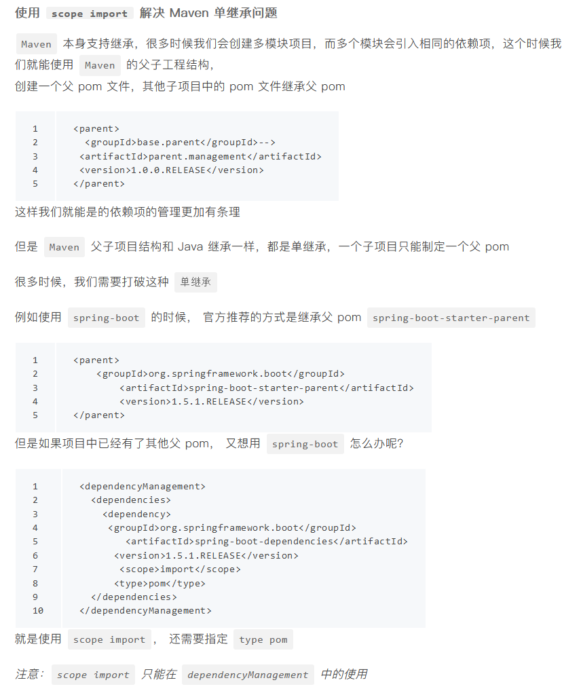

### dependencies与dependencyManagement的区别
#### dependencyManagement
这个常用于多模块项目。dependencyManagement在父项目中声明，用于版本的管理,让子项目中引用一个依赖而不用显示的列出版本号，这样的话也方便更改版本Maven会沿着父子层次向上走，直到找到一个拥有dependencyManagement元素的项目，然后它就会使用在这个dependencyManagement元素中指定的版本号。
dependencyManagement里只是声明依赖，并不实现引入，因此子项目需要显示的声明需要用的依赖。如果不在子项目中声明依赖，是不会从父项目中继承下来的，只有在子项目中写了该依赖项，并且没有指定具体版本，才会从父项目中继承该项，并且version和scope都读取自父pom;另外如果子项目中指定了版本号，那么会使用子项目中指定的jar版本。

#### dependencies
子项目会继承父项目的dependencies，如果某个子项目需要另外一个版本号时，只需要在dependencies中声明一个版本号即可。子项目就会使用子项目声明的版本号，不继承于父项目版本号。

### Maven项目中＜packaging＞＜/packaging＞
项目的打包类型：pom、jar、war
packing默认是jar类型，
pom ---------> 父类型都为pom类型
jar ---------> 内部调用或者是作服务使用
war ---------> 需要部署的项目

#### Maven 继承方式： scope import 

